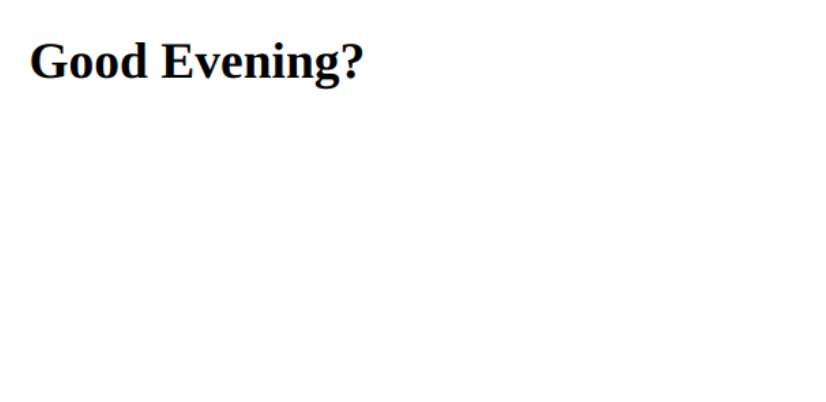

## Description

The hello rails react app is a  project created to teach me how to use the rails react gem with ruby.

## App screenshot



## Built With

- Ruby
- Ruby on Rails
- React

## Getting Started

To get the content of this project locally you need to run this command in your terminal:
``` bash
git clone your https://github.com/billionsjoel/hello-rails-react.git
cd hello rails react
bundle install
rails s
```


## Authors

👤 **Atugonza Joel Billions**

- GitHub: [@billionsjoel](https://github.com/billionsjoel)
- Twitter: [@billionsjoel](https://twitter.com/billionsjoel)
- LinkedIn: [billionsjoel](https://www.linkedin.com/in/billionsjoel)


## Show your support

Give a ⭐️ if you like this project!

## Acknowledgments

- Hat tip to Microverse


## 📝 License

This project is [MIT](./MIT.md) licensed.
